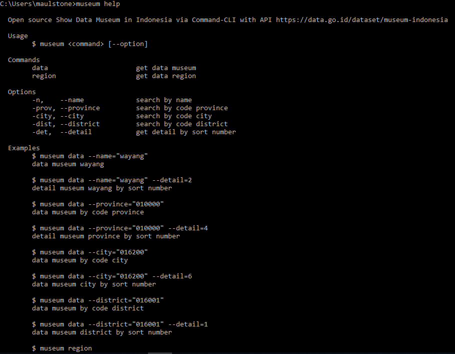

# museum-id
Open source Show Data Museum in Indonesia via Command-CLI with API https://data.go.id/dataset/museum-indonesia

[x] Profil Museum Indonesia
[x] Museum Indonesia Berdasarkan Provinsi
[x] Museum Indonesia Berdasarkan Kabupaten/Kota
[x] Museum Indonesia Berdasarkan Kecamatan
[x] Museum Indonesia Berdasarkan Nama
[x] Data Provinsi
[x] Data Kabupaten/Kota Berdasarkan Provinsi
[x] Data Kecamatan Berdasarkan Kabupaten/Kota

### Instalasi
#### Install paket museum-id pada global
```js
npm install -g museum-id
```
#### Install paket runner (eksekusi) dengan npx
```js
npm install -g npx
```
#### Eksekusi paket museum-id dengan npx
```js
npx museum-id
```

### Menampilkan Tentang Aplikasi Dan Info Bantuan
```js
museum help
```

### Museum Data Informasi
Merupakan data informasi mengenai semua museum yang ada di indonesia.

#### Menampikan Data Pencarian Berdasarkan Provinsi
##### Pencarian
```js
museum data --province="<kode_wilayah>"
```
##### Detail Sesuai Dengan No Urut
```js
museum data --province="<kode_wilayah>" --detail=<no_urut>
```

#### Menampilkan Data Pencarian Berdasarkan Kabupaten/Kota
##### Pencarian
```js
museum data --city="<kode_wilayah>"
```
##### Detail Sesuai Dengan No Urut
```js
museum data --city="<kode_wilayah>" --detail=<no_urut>
```

#### Menampilkan Data Pencarian Berdasarkan Kecamatan
##### Pencarian
```js
museum data --district="<kode_wilayah>"
```
##### Detail Sesuai Dengan No Urut
```js
museum data --district="<kode_wilayah>" --detail=<no_urut>
```

#### Menampilkan Data Pencarian Berdasarkan Nama
##### Pencarian
```js
museum data --name="<kode_wilayah>"
```
##### Detail Sesuai Dengan No Urut
```js
museum data --name="<kode_wilayah>" --detail=<no_urut>
```

### Museum Data Wilayah
Merupakan data wilayah yang mencakup provinsi, kabupaten/kota, kecamatan. Perlu di ketahui data wilayah ini memiliki kode diantaranya :
- <b>kode wilayah</b> merupakan kode sesuai pada nama wilayah yang di tuju
- <b>kode induk</b> merupakan induk pada kode wilayah

catatan => kode wilayah bisa berupa kode diantaranya : provinsi, kabupaten/kota, dan kecamatan

#### Menampilkan Data Wilayah Awal <Provinsi>
```js
museum region
```

#### Menampilkan Data Wilayah Berdasarkan Kode Wilayah
```js
museum region --code="<kd_wilayah>"
```

### Tampilan
[](./../../)

### Author

[Maulana Saputra](mailto:maulanasaputra11091082@gmail.com)
